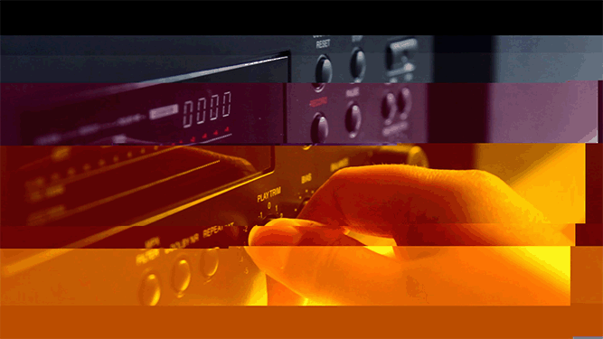

DataBending
===========
#### A sketch to produce a series of "glitched" images.

**Usage**

Put the image(s) inside the data folder and run the sketch.

---

Don't worry. The console will spit out stuff like `Corrupt JPEG data: premature end of data segment` or `Corrupt JPEG data: bad Huffman code` or even this one:

	sun.awt.image.ImageFormatException: Bogus DQT index 6
	at sun.awt.image.JPEGImageDecoder.readImage(Native Method)
	at sun.awt.image.JPEGImageDecoder.produceImage(JPEGImageDecoder.java:119)
	at sun.awt.image.InputStreamImageSource.doFetch(InputStreamImageSource.java:246)
	at sun.awt.image.ImageFetcher.fetchloop(ImageFetcher.java:172)
	at sun.awt.image.ImageFetcher.run(ImageFetcher.java:136)"
	
but i does it's job!

---	

_Here's how it goes_

1. Fetch a file from the "data" folder
2. Save it as a new file into the "processed" folder. Open it up randomly (still have to figure out where the maximum should be for good looking results!!)
3. Every time the file is open, move some data inside of the file (but only after the header bytes)
3. When done re-opening/re-saving, flush the viewport into the same file in "processed"
4. Since the file is just the result of the flush and not the actual process, Processing writes a correct header and you may use the file in After Effects or whatever program you like to use for your artsy fartsy projects :3